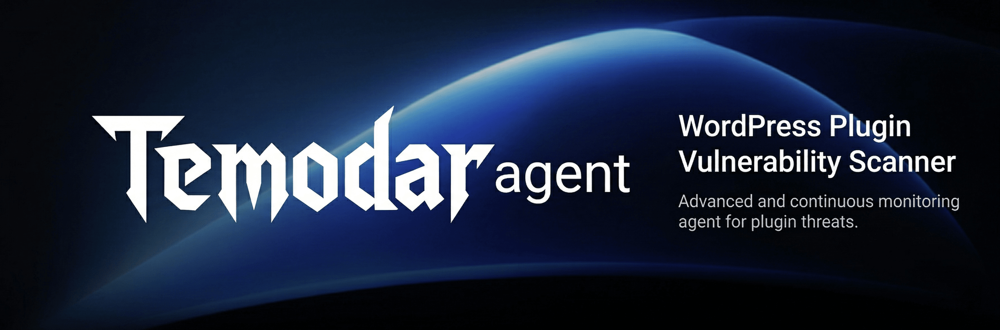

<div align="center">
  
</div>

<p align="center">
  
  
  
</p>

WP-Hunter is a **WordPress plugin/theme reconnaissance and static analysis (SAST) tool**. It is designed for **security researchers** to evaluate the **vulnerability probability** of plugins by analyzing metadata, installation patterns, update histories, and performing deep **Semgrep-powered source code analysis**.

## 🚀 Key Features

*   **Real-time Web Dashboard**: A modern FastAPI-powered interface for visual scanning and analysis.
*   **Deep SAST Integration**: Integrated **Semgrep** scanning with custom rule support.
*   **Offline Recon**: Sync the entire WordPress plugin catalog to a local SQLite database for instant querying.
*   **Risk Scoring (VPS)**: Heuristic-based scoring to identify the "low hanging fruit" in the WordPress ecosystem.
*   **Theme Analysis**: Support for scanning the WordPress theme repository.
*   **Security Hardened**: Built-in SSRF protection and safe execution patterns.

---

## 🖥️ Modern Web Dashboard

WP-Hunter now features a powerful local dashboard for visual researchers.

### Dashboard Gallery

<table>
  <tr>
    <td width="50%">
      <b>Main Interface</b><br>
      Configure scan parameters with intuitive controls
    </td>
    <td width="50%">
      <b>Scan History</b><br>
      Track and manage all your previous scans
    </td>
  </tr>
  <tr>
    <td>
      
    </td>
    <td>
      
    </td>
  </tr>
  <tr>
    <td width="50%">
      <b>Scan Details with Semgrep</b><br>
      Deep SAST analysis with issue tracking
    </td>
    <td width="50%">
      <b>Security Rulesets</b><br>
      Manage OWASP and custom Semgrep rules
    </td>
  </tr>
  <tr>
    <td>
      
    </td>
    <td>
      
    </td>
  </tr>
  <tr>
    <td colspan="2" align="center">
      <b>CLI Output</b><br>
      Rich terminal interface with vulnerability intelligence
    </td>
  </tr>
  <tr>
    <td colspan="2">
      
    </td>
  </tr>
</table>

### Dashboard Capabilities:
*   **Real-time Execution Sequence**: Watch scan results stream in via WebSockets.
*   **Integrated Semgrep**: Run deep static analysis on specific plugins with one click.
*   **Scan History**: Save and compare previous scan sessions.
*   **Favorites System**: Track "interesting" targets for further manual review.
*   **Custom Rules**: Add and manage your own Semgrep security rules directly from the UI.

---

## 📦 Installation

### Prerequisites
- Python 3.8 or higher
- pip (Python package installer)
- Semgrep is installed automatically with `pip install -r requirements.txt` on Python 3.10+

### Setup
1. Clone the repository:
```bash
git clone https://github.com/xeloxa/WP-Hunter.git
cd WP-Hunter
```
2. Create and activate a virtual environment:
```bash
python3 -m venv venv
source venv/bin/activate  # On Windows: venv\Scripts\activate
```
3. Install dependencies:
```bash
pip install -r requirements.txt
```

## 🛠️ Usage

### 1. Start WP-Hunter (Docker + Web UI)
```bash
chmod +x run.sh
./run.sh
```
Access the interface at `http://127.0.0.1:8080`.

### 2. Run Scans from Dashboard
- Configure scan filters in **NEW SCAN**.
- Click **RUN SCAN**.
- Open plugin details for Semgrep audit actions.

---

## 🎯 Hunter Strategies

### 1. The "Zombie" Hunt (High Success Rate)
Target plugins that are widely used but abandoned.
*   **Logic:** Legacy code often lacks modern security standards (missing nonces, weak sanitization).
*   **Dashboard Preset:** Enable `Abandoned`, keep `Min Installs` high, and sort by update freshness.

### 2. The "Aggressive" Mode
For high-speed, high-concurrency reconnaissance across large scopes.
*   **Dashboard Preset:** Increase `Pages`, keep `Limit` high/zero, and enable `Smart Mode`.

### 3. The "Complexity" Trap
Target complex functionality (File Uploads, Payments) in mid-range plugins.
*   **Dashboard Preset:** Enable `Smart Mode`, set a moderate install range, then run Semgrep audit from plugin details.

---

## 📊 VPS Logic (Vulnerability Probability Score)

The score (0-100) reflects the likelihood of **unpatched** or **unknown** vulnerabilities:

| Metric | Condition | Impact | Reasoning |
|--------|-----------|--------|-----------|
| **Code Rot** | > 2 Years Old | **+40 pts** | Abandoned code is a critical risk. |
| **Attack Surface** | Risky Tags | **+30 pts** | Payment, Upload, SQL, Forms are high complexity. |
| **Neglect** | Support < 20% | **+15 pts** | Developers ignoring users likely ignore security reports. |
| **Code Analysis** | Dangerous Funcs | **+5-25 pts** | Presence of `eval()`, `exec()`, or unprotected AJAX. |
| **Tech Debt** | Outdated WP | **+15 pts** | Not tested with the latest WordPress core. |
| **Maintenance** | Update < 14d | **-5 pts** | Active developers are a positive signal. |

---

## ⚖️ Legal Disclaimer

This tool is designed for **security research and authorized reconnaissance** purposes only. It is intended to assist security professionals and developers in assessing attack surfaces and evaluating plugin health. The authors are not responsible for any misuse. Always ensure you have appropriate authorization before performing any security-related activities.

## 📄 Licensing Notes

- WP-Hunter is licensed under MIT (`LICENSE`).
- Semgrep is used as a third-party scanner and keeps its own `LGPL-2.1` license.
- See `THIRD_PARTY_LICENSES.md` for details.
- Canonical LGPL text is included at `licenses/LGPL-2.1.txt`.
- Docker image redistributes license artifacts under `/licenses`.

---

<a href="https://www.star-history.com/#xeloxa/wp-hunter&type=date&legend=top-left">
 <picture>
   <source media="(prefers-color-scheme: dark)" srcset="https://api.star-history.com/svg?repos=xeloxa/wp-hunter&type=date&theme=dark&legend=top-left" />
   <source media="(prefers-color-scheme: light)" srcset="https://api.star-history.com/svg?repos=xeloxa/wp-hunter&type=date&legend=top-left" />
   
 </picture>
</a>
